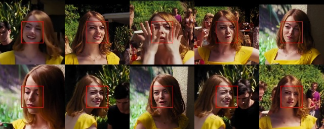
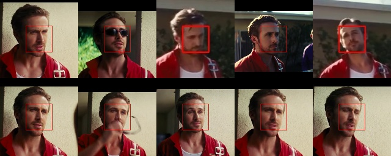
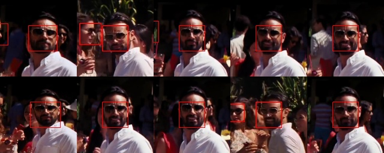
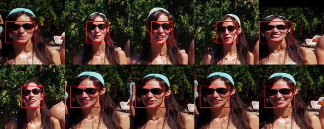

# Face Clustering

Face clustering implementation using python.

* read video from file or web cam
* detect faces in the frame
* encode the faces
* save/load the encodings using pickle
* cluster the encodings using DBSCAN algorithm
* save the clustered faces in separated directory

```
$ python face_clustering.py -h
usage: face_clustering.py [-h] [-e ENCODE] [-c CAPTURE] [-s STOP]

optional arguments:
  -h, --help            show this help message and exit
  -e ENCODE, --encode ENCODE
                        video file to encode or '0' to encode web cam
  -c CAPTURE, --capture CAPTURE
                        # of frame to capture per second
  -s STOP, --stop STOP  stop encoding after # seconds

$ python face_clustering.py -e video_file.mp4    # cluster faces in video_file

$ python face_clustering.py -e 0                 # video input from web cam
```

# Result Example

## Cluster the faces in this video:

[](https://www.youtube.com/watch?v=bUQj7Ng7PCs)

## Results:

* ID1
<p align="center">
   
</p>

* ID3
<p align="center">
   
</p>

* ID6
<p align="center">
   
</p>

* ID7
<p align="center">
   
</p>
