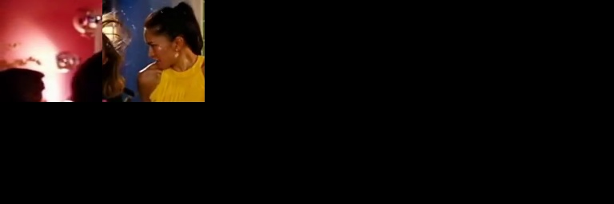
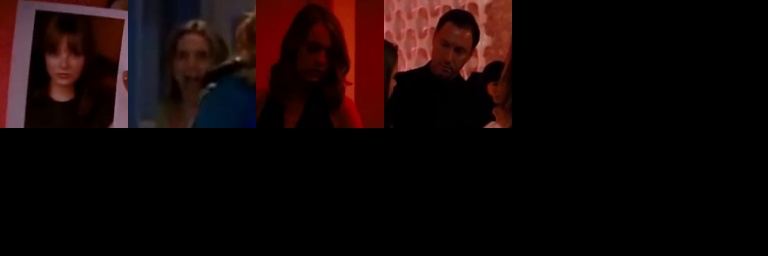

# Unknown Face Classifier

* read video from file or web cam
* detect faces in the frame
* encode the faces
* compare the encoding with the previously saved faces
* if the encoding is similar with any person, save the face to the person
* if the encoding is similar with any face of unknowns, create new person
* otherwise, save the face to unknown faces

# Usage


```
$ python face_classifier.py -h
usage: face_classifier.py [-h] [-t THRESHOLD] [-S SECONDS] [-s STOP] [-k SKIP]
                          [-d] [-c CAPTURE]
                          inputfile

positional arguments:
  inputfile             video file to detect or '0' to detect from web cam

optional arguments:
  -h, --help            show this help message and exit
  -t THRESHOLD, --threshold THRESHOLD
                        threshold of the similarity (default=0.44)
  -S SECONDS, --seconds SECONDS
                        seconds between capture
  -s STOP, --stop STOP  stop detecting after # seconds
  -k SKIP, --skip SKIP  skip detecting for # seconds from the start
  -d, --display         display the frame in real time
  -c CAPTURE, --capture CAPTURE
                        save the frames with face in the CAPTURE directory
```

# Result

The result is saved in the `result` directory. This result is loaded on the next execution.

* Check the classified faces in the `person_##` directory.
* Change the directory name `person_##` to real name.
* Move the wrongly classified faces to correct directory or `unknowns`. This will improve the accuracy on the next execution.

You can remove or rename the `result` directory to prevent from loading.

# Example Result

Tested with this video in YouTube (La La Land, Someone in the Crowd)
[](https://www.youtube.com/watch?v=A7RmBgq4tT4)

```
$ python face_classifier.py ~/Videos/SomeoneInTheCrowd.mp4 -t 0.55
source /home/rostude/Videos/SomeoneInTheCrowd.mp4
1280x512, 29.970030 frame/sec
capture every 30 frame
similarity shreshold: 0.55
press ^C to stop detecting immediately
frame 8310 @ time 277.277 takes 0.324 seconds - 9 persons, 180 known faces, 4 unknown faces
similarities of persons:
person1    [ 0.000 0.496 0.468 0.306 0.447 0.697 0.678 0.560 0.680 ]
person2    [ 0.496 0.000 0.500 0.519 0.516 0.766 0.705 0.281 0.798 ]
person3    [ 0.468 0.500 0.000 0.371 0.397 0.665 0.662 0.515 0.689 ]
person4    [ 0.306 0.519 0.371 0.000 0.338 0.598 0.630 0.552 0.580 ]
person5    [ 0.447 0.516 0.397 0.338 0.000 0.634 0.467 0.565 0.629 ]
person6    [ 0.697 0.766 0.665 0.598 0.634 0.000 0.775 0.790 0.417 ]
person7    [ 0.678 0.705 0.662 0.630 0.467 0.775 0.000 0.769 0.794 ]
person8    [ 0.560 0.281 0.515 0.552 0.565 0.790 0.769 0.000 0.814 ]
person9    [ 0.680 0.798 0.689 0.580 0.629 0.417 0.794 0.814 0.000 ]
saving pictures in the directory 'SomeoneInTheCrowd'
```

person1
<p align="center">
   
</p>

person2
<p align="center">
   
</p>

person3
<p align="center">
   
</p>

person4
<p align="center">
   
</p>

person5
<p align="center">
   
</p>

person6
<p align="center">
   
</p>

person7
<p align="center">
   
</p>

person8
<p align="center">
   
</p>

person9
<p align="center">
   
</p>

unknown_faces
<p align="center">
   
</p>

