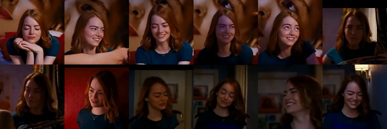
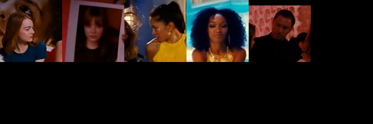

# Unknown Face Classifier

* read video from file or web cam
* detect faces in the frame
* encode the faces
* compare the encoding with the previously saved faces
* if the encoding is similar with any person, save the face to the person
* if the encoding is similar with any face of unknowns, create new person
* otherwise, save the face to unknown faces

# Usage


```bash
$ python face_classifier.py -h
usage: face_classifier.py [-h] [-t THRESHOLD] [-S SECONDS] [-s STOP] [-k SKIP]
                          [-d] [-c CAPTURE] [-r RESIZE_RATIO]
                          inputfile

positional arguments:
  inputfile             video file to detect or '0' to detect from web cam

optional arguments:
  -h, --help            show this help message and exit
  -t THRESHOLD, --threshold THRESHOLD
                        threshold of the similarity (default=0.44)
  -S SECONDS, --seconds SECONDS
                        seconds between capture
  -s STOP, --stop STOP  stop detecting after # seconds
  -k SKIP, --skip SKIP  skip detecting for # seconds from the start
  -d, --display         display the frame in real time
  -c CAPTURE, --capture CAPTURE
                        save the frames with face in the CAPTURE directory
  -r RESIZE_RATIO, --resize-ratio RESIZE_RATIO
                        resize the frame to process (less time, less accuracy)
```

# Result

The result is saved in the `result` directory. This result is loaded on the next execution.

* Check the classified faces in the `person_##` directory.
* Change the directory name `person_##` to real name.
* Move the wrongly classified faces to correct directory or `unknowns`. This will improve the accuracy on the next execution.

You can remove or rename the `result` directory to prevent from loading.

# Example Result

Tested with this video in YouTube (La La Land, Someone in the Crowd)

[](https://www.youtube.com/watch?v=A7RmBgq4tT4)

```bash
$ python face_classifier.py ~/Videos/SomeoneInTheCrowd.mp4 -t 0.55
source /home/rostude/Videos/SomeoneInTheCrowd.mp4
original: 1280x512, 29.970030 frame/sec
process every 30 frame
similarity shreshold: 0.55
0 persons, 0 known faces, 0 unknown faces
Press ^C to stop detecting...
frame 8310 @ time 277.277 takes 0.326 second, 0 new faces -> 6 persons, 179 known faces, 5 unknown faces
total elapsed time: 134.171 second
Start saving persons in the directory 'result'
montages saved
result/face_encodings saved
Saving persons finished in 0.701 sec.
6 persons, 179 known faces, 5 unknown faces
person_01  [ 0.000 0.492 0.441 0.339 0.428 0.647 ] 0.359, 0.407, 0.459, 13 faces
person_02  [ 0.492 0.000 0.443 0.509 0.460 0.709 ] 0.227, 0.343, 0.565, 102 faces
person_03  [ 0.441 0.443 0.000 0.367 0.358 0.610 ] 0.342, 0.395, 0.498, 16 faces
person_04  [ 0.339 0.509 0.367 0.000 0.337 0.509 ] 0.349, 0.403, 0.464, 19 faces
person_05  [ 0.428 0.460 0.358 0.337 0.000 0.571 ] 0.372, 0.422, 0.486, 21 faces
person_06  [ 0.647 0.709 0.610 0.509 0.571 0.000 ] 0.223, 0.323, 0.424, 8 faces
```

person_01
<p align="center">
   
</p>

person_02
<p align="center">
   
</p>

person_03
<p align="center">
   
</p>

person_04
<p align="center">
   
</p>

person_05
<p align="center">
   
</p>

person_06
<p align="center">
   
</p>

unknown_faces
<p align="center">
   
</p>

Visit [https://ukayzm.github.io/unknown-face-classifier/](https://ukayzm.github.io/unknown-face-classifier/) for more information.
