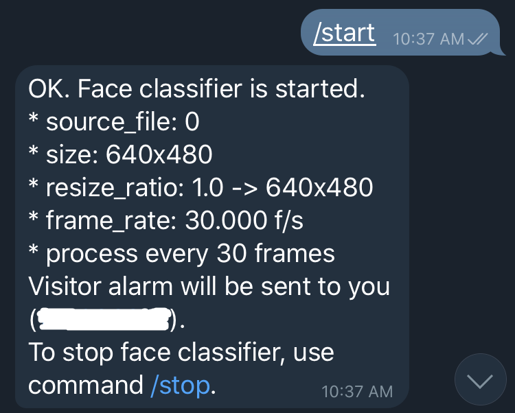

# Visitor Alarm

This is a Telegram Bot doing the folowings:

* read video from web cam
* detect faces in the frame
* compare the face with the previously saved faces
* if new person is detected, send a message via Telegram

This code is highly refering to [unknown_face_classifier](https://github.com/ukayzm/opencv/tree/master/unknown_face_classifier). I recommend you to read it first.

# Usage

```bash
$ python visitor_alarm.py -h
usage: visitor_alarm.py [-h] --token TOKEN [--srcfile SRCFILE]

optional arguments:
  -h, --help         show this help message and exit
  --token TOKEN      Telegram Bot Token
  --srcfile SRCFILE  Video file to process. If not specified, web cam is used.
```

You have to make a Telegram bot before doing this. Please search Google for how to make a Telegram Bot.

Once you make the bot, execute visitor_alarm.py with the token as a parameter.

```bash
$ python visitor_alarm.py --token '1234567890:ABCDEFGHIJKLMNOPQRSTUVWXYZABCDEFGHI'
telegram bot with token 1234567890:ABCDEFGHIJKLMNOPQRSTUVWXYZABCDEFGHI
press ^C to stop...
```

Or you can specify `--srcfile` parameter to use a video file instead of webcam. This is useful for the testing purpose.

```bash
$ python visitor_alarm.py --token '1234567890:ABCDEFGHIJKLMNOPQRSTUVWXYZABCDEFGHI' --srcfile ~/Videos/prc.mp4
```

Then, open a chat with the bot in Telegram app on your phone. Input `/start` to start face classifier. Input `/help` for more commands.

| Available Commands | Comments |
|--------------------|----------|
| /help | show available commands |
| /settings | show settings |
| /start | start face classifier |
| /stop | stop face classifier |
| /status | show the status of person DB and face classifier |
| /shot | show the current screen of web cam (or the video) |
| /name old_name new_name | change the person's name |
| /list | list all persons with picture |

# Screen shots

## settings

Show settings.

<p align="center">
   
</p>

## start

Start face classifier.

<p align="center">
   
</p>

## On New Person

When new person is detected, a message is delivered to the user.

<p align="center">
   
</p>

## status

Show the current status.

<p align="center">
   
</p>

## stop

Stop face classifier.

<p align="center">
   
</p>

## name

You can change the name of person.

<p align="center">
   
</p>

